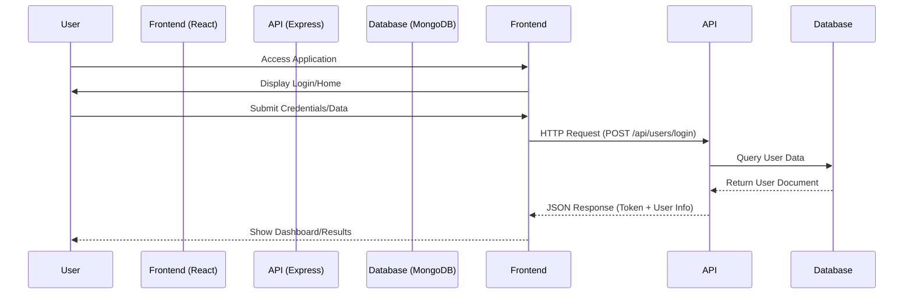
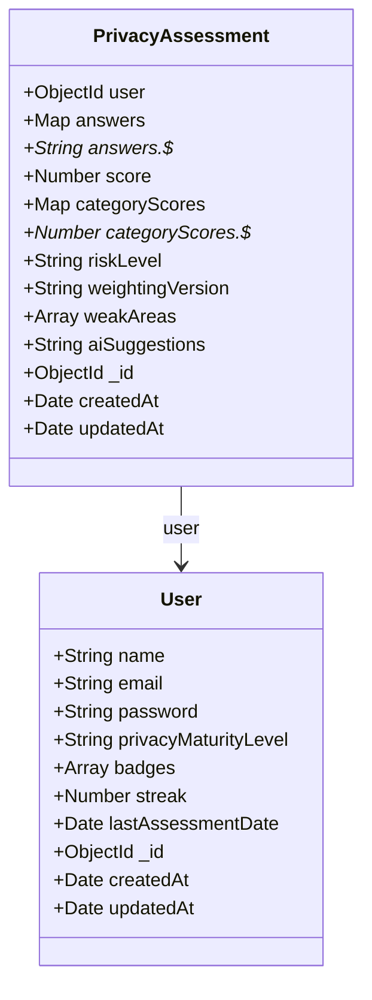
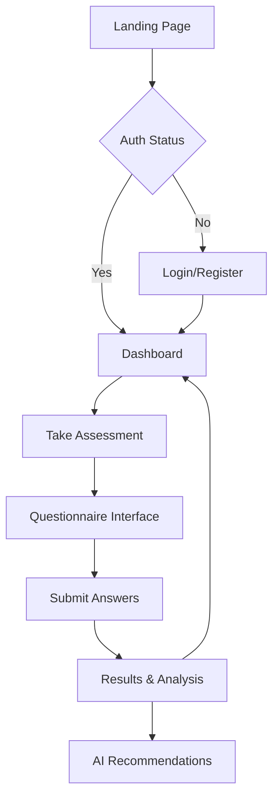

# Project Documentation: Privacy Settings Checker

## 1. Tech Stack & Architecture

### Technology Stack Justification
This project utilizes the **MERN Stack** (MongoDB, Express.js, React, Node.js).
-   **MongoDB**: NoSQL database, perfect for flexible schema requirements of privacy assessment answers and JSON-like document storage.
-   **Express.js**: Minimalist web framework for Node.js, efficient for handling API routes and middleware.
-   **React (v19)**: Component-based library for building a dynamic, interactive user interface.
    -   *Libraries*: `react-router-dom` for navigation, `chart.js` for visualizing scores, `bootstrap` for responsive layout.
-   **Node.js**: JavaScript runtime environment that allows using a single language (JavaScript) for both client and server.

### System Flow Diagram
The following diagram illustrates how the components interact:



---

## 2. DB Schema & Entity Design

### ER Diagram
The following Entity Relationship Diagram (ERD) represents the data structure:



-   **User**: Stores authentication and profile data, along with gamification elements (badges, streak).
-   **PrivacyAssessment**: unique record for each assessment taken, linked to a User. Stores detailed answers, calculated scores, and AI suggestions.

---

## 3. UI/UX Wireframes & Theme

### User Journey Flow
Since static wireframes cannot be embedded, the following flow describes the user experience:



### Theme & Palette
-   **Primary Color**: Green (implied for "Safe" or "Privacy").
-   **Design System**: Bootstrap 5 + Custom CSS.
-   **Key Visuals**:
    -   Score Circle: A large, central visual indicator of the privacy score.
    -   Cards: Used for separating content (Login form, results stats).
    -   Charts: Visual representation of risk levels.

---

## 4. Project Boilerplate Setup

### Folder Structure
The project follows a standard split-repo structure:

```text
privacy-checker/
├── backend/                # Server-side code
│   ├── config/             # Database configuration
│   ├── controllers/        # Request logic
│   ├── middleware/         # Auth & Error handling
│   ├── models/             # Mongoose schemas
│   ├── routes/             # API definition
│   ├── scripts/            # Utility scripts (e.g., diagram gen)
│   ├── utils/              # Helper functions
│   └── server.js           # Entry point
├── frontend/               # Client-side code
│   ├── public/             
│   └── src/                # React components & styles
└── .gitignore              # Git configuration
```

### Environment Configuration
The application requires a `.env` file in the `backend` directory:
```env
NODE_ENV=development
PORT=5000
MONGO_URI=your_mongodb_connection_string
JWT_SECRET=your_jwt_secret
```

---

## 5. GitHub Workflow & Documentation

### Git Setup
-   **Repository**: Initialized at root `c:\privacy-checker`.
-   **Ignored Files**: `node_modules`, `.env`, logs (defined in `.gitignore`).

### Branching Strategy
Recommended strategy for future development:
1.  **main**: Stable, production-ready code.
2.  **develop**: Integration branch for ongoing work.
3.  **feature/feature-name**: Individual branches for new features (e.g., `feature/auth-redesign`).

### Development Workflow
1.  **Clone**: `git clone <repo_url>`
2.  **Install**:
    -   `cd backend && npm install`
    -   `cd frontend && npm install`
3.  **Run**:
    -   Backend: `npm run server` or `npm run dev` (if nodemon is set up).
    -   Frontend: `npm start`.
